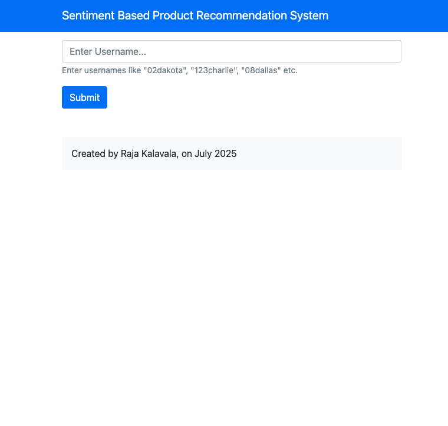
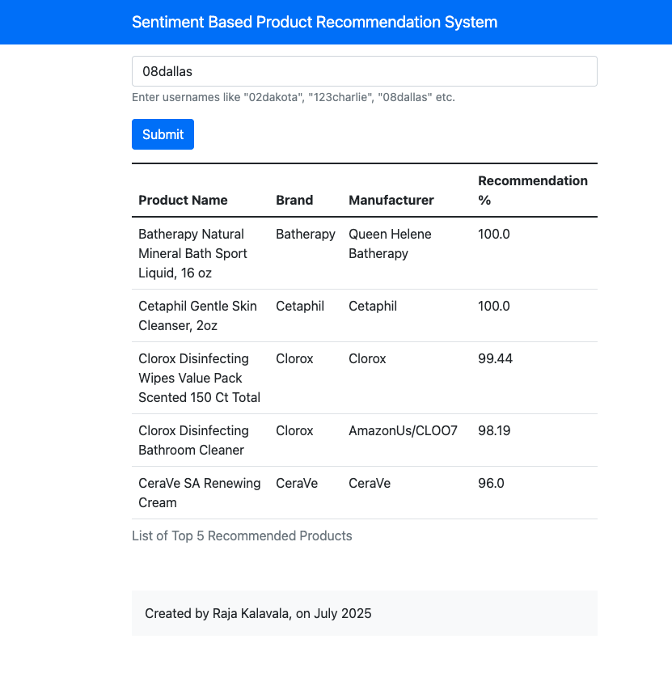

# Sentiment Based Product Recommendation

## Problem Statement

The e-commerce industry has reshaped the way consumers shop, shifting the focus from physical retail spaces to digital marketplaces. With major players like Amazon and Flipkart revolutionizing online shopping, the convenience of browsing and purchasing products from anywhere has become the new norm.

Recognizing the vast potential in this space, Ebuss is emerging as a strong contender, expanding its footprint across multiple product segments—from everyday goods to tech gadgets. In its quest to thrive in this competitive ecosystem, Ebuss understands that technological innovation is not optional—it’s essential.

To truly compete and stand out, Ebuss aims to go beyond basic offerings by creating a more personalized, intelligent shopping experience. At the heart of this effort is a plan to build a sentiment-aware product recommendation system.

As a Machine Learning Engineer at Ebuss, your role involves creating this intelligent recommendation framework, consisting of the following key components:

1. Extracting Sentiment from User Feedback: Gather user-generated content such as reviews and ratings to understand their opinions and emotions.

2. Constructing the Core Recommendation System: Develop an algorithm that suggests products based on user behavior and preferences.

3. Enriching with Sentiment Intelligence: Integrate sentiment data to improve recommendation relevance and personalize the experience further.

4. Delivering the Final Product: Deploy a fully functional application with a user-friendly interface that showcases the recommendation system in action.

In today’s fast-paced digital commerce world, customer-centric innovation is vital. By embedding sentiment understanding into the recommendation engine, Ebuss aspires to enhance user engagement, increase satisfaction, and build lasting loyalty.

## Links

- github link: https://github.com/ankurdhuriya/SentimentBasedProductRecommendation
- Deployed link: https://productrecommendationsystem-1.onrender.com

## Screenshots

## 🔍 Workflow Breakdown

### 1. **Understanding the Data**

The project begins with a thorough exploration of the dataset, including a review of all attributes and structure. All relevant documentation and schema are available in the dataset folder for reference.

### 2. **Data Cleaning & Preprocessing**

Before model building, the data undergoes necessary cleansing and transformation steps:

- Text data (`review_title` and `review_text`) is combined.
- NLP techniques such as tokenization and stopword removal are applied.
- The TF-IDF method is used to vectorize the text, capturing the importance of terms across the corpus.

### 3. **Handling Class Imbalance**

To tackle imbalanced sentiment classes (positive vs. negative), the SMOTE technique is implemented, generating synthetic samples for the minority class to balance the dataset.

### 4. **Sentiment Classification Models**

Several classification algorithms are trained to categorize user sentiment (1 = positive, 0 = negative):

- Logistic Regression
- Naive Bayes
- Decision Tree
- Random Forest
- XGBoost

Models are evaluated using metrics like Accuracy, Precision, Recall, F1 Score, and AUC. Among all, **XGBoost** is identified as the most effective based on its performance across metrics.

### 5. **Recommendation System with Collaborative Filtering**

To generate personalized product suggestions, both **User-User** and **Item-Item** collaborative filtering methods are implemented. Model effectiveness is validated using **RMSE** (Root Mean Squared Error).

### 6. **Product Sentiment Aggregation**

Top 20 products are shortlisted using the recommender output. For each, user sentiment is predicted across all associated reviews. The top 5 products with the highest proportion of positive feedback are selected for final recommendations.

---

## 🚀 Deployment Strategy

- **Model Serialization**: Trained models are saved as `.pkl` files under the `/pickle` directory for easy reuse and deployment.
- **API Development**: A lightweight Flask API (`app.py`) enables testing and interaction with the models.
- **Frontend Interface**: A simple, responsive user interface is built using Bootstrap and Jinja templates (`templates/index.html`). The UI is kept minimal without any custom styling.

---

## 📁 Key Components

| File/Folder                                 | Description                                                                 |
| ------------------------------------------- | --------------------------------------------------------------------------- |
| `SentimentBasedProductRecommendation.ipynb` | Main notebook covering EDA, sentiment modeling, and collaborative filtering |
| `model.py`                                  | Logic to filter and rank top products based on predicted sentiment          |
| `app.py`                                    | Flask API for serving predictions                                           |
| `/pickle`                                   | Directory containing serialized models                                      |
| `/templates/index.html`                     | Basic UI for user interaction                                               |

---

## ✅ Outcome

The system successfully integrates sentiment understanding into product recommendations, enabling more personalized and emotionally intelligent suggestions. This end-to-end solution is designed to enhance customer experience and satisfaction in a competitive e-commerce environment.
